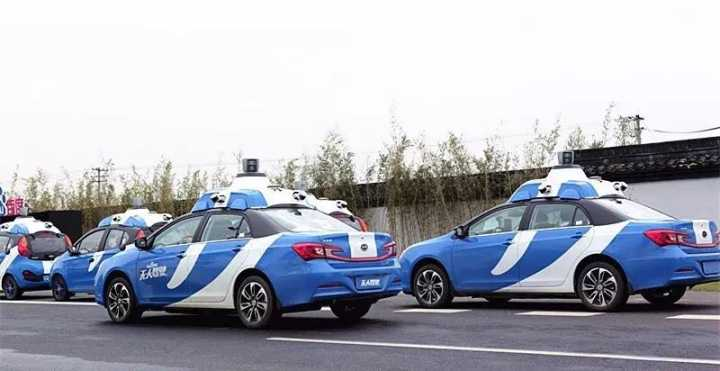

# 目前国内无人驾驶达到什么水准？美国到底领先中国多少？国内又有哪些值得关注的无人驾驶技术呢？ - 知乎

[首页](https://www.zhihu.com/)[发现](https://www.zhihu.com/explore)[话题](https://www.zhihu.com/topic)

登录加入知乎

# 目前国内无人驾驶达到什么水准？美国到底领先中国多少？国内又有哪些值得关注的无人驾驶技术呢？

关注问题

写回答

[汽车](https://www.zhihu.com/topic/19551915)

[科技](https://www.zhihu.com/topic/19556664)

[汽车行业](https://www.zhihu.com/topic/19585985)

[自动驾驶](https://www.zhihu.com/topic/19635352)

[无人驾驶车](https://www.zhihu.com/topic/19653871)

# 目前国内无人驾驶达到什么水准？美国到底领先中国多少？国内又有哪些值得关注的无人驾驶技术呢？

现在许多车上已经配备了所谓的半自动驾驶技术，那我们离真正的无人驾驶还有多远距离？美国已经逐渐将区域化试运行无人驾驶，似乎美国无论在技术还是政策方面都已…显示全部

关注者

 **2,075**

被浏览

 **425,041**

关注问题

写回答

​

4 条评论

​

分享

​

邀请回答

​

[查看全部 70 个回答](https://www.zhihu.com/question/54217494)
![noteattachment1][2cb830116b11050f0ebc03517cdd06d8]
[![noteattachment1][2cb830116b11050f0ebc03517cdd06d8]](https://www.zhihu.com/people/xinhe-
sun)

[xinhe sun](https://www.zhihu.com/people/xinhe-sun)

收录于 编辑推荐 · 296 人赞同了该回答

我认为， **自动驾驶是早晚的事，现在看来，自动驾驶的普及速度比预想的还要快。**  
自动驾驶一旦大规模普及，很多功能将会成为现实，比如：车辆可以像动车一样编组运行以实现同步高速度的交通，车与车之间的通讯和交互可以实现高效的通行效率和极低的事故率，甚至不需要红绿灯及各种复杂的交通标志标线系统，总体的交通效率和安全性将大大提高，是革命性的。  
用不了多久，就会有人说：“开车这么危险的事情，以前竟然让人去做，这简直太吓人了，不可想象。”，当然“女司机”这个说法可能也要退出历史舞台了。  
很多朋友担心交通基础设施以及法律责任等问题，我觉得这点不用太担心，自动驾驶普及的过程，也是相关的交通技术设施和法律不断完善的过程。  
今天主要分析一下自动驾驶的技术层面，其他相关的道路设施及法律责任等问题在这里不讨论了。  
首先简单说一下 **自动驾驶的原理** 。  
所有的控制系统都是由传感器、控制器和执行器组成的，从这个角度上讲，自动驾驶原理其实和人工驾驶是一样的，我们用眼睛观察路况，而自动驾驶则是使用激光雷达、超声波雷达、摄像头、GPS等传感器来观察路况确定位置。我们用大脑做判断，自动驾驶当然就是用电脑作为控制器来判断。然后我们通过手脚控制车辆方向盘、加速和刹车，自动驾驶也是根据电脑的输出直接去控制车辆。  
看上去很简单，但是要深入分析的话，特别是汽车这么危险的东西，要想保证自动驾驶的可靠性的话，其实非常复杂。  

![noteattachment2][ad801cd0a9b8d45f25114a7c21fe2f8e]

 **传感器方面**
，激光雷达和超声波雷达当然都是用来测距的，理想状态下车辆可以探测到周围所有的障碍物并算出这些障碍物的距离，但是实际上，这些障碍物很可能会被误判，比如风中飞舞的塑料袋会被判断为障碍物，甚至雨滴有可能被认为是障碍物。摄像头更不用说了，单目或多目摄像头利用计算机视觉让自动驾驶汽车实时识别交通信号灯、交通标志、车道线、近距离低速障碍物等，同时加上与道路基础设施以及云端数据库的通信，实现诸多功能。但是，今年特斯拉自动驾驶出现的死亡事故很大程度上与摄像头有关系。在逆光和大光比的情况下，摄像头的分辨能力就降低了，当然还有低照度情况，这个受限于当前的图像传感器技术，懂摄影的朋友都会知道，机器视觉本来就是一个复杂的东西，同时摄像头有可能被灰尘、眩光等各种不利因素影响，所有从可靠性上讲，依然存在很多问题。当然除了这些判断路况的传感器，汽车还有车速、加速度、转角度等各种传感器。  
 **

![noteattachment3][1b1c1d2ed244d497de58b674f136d187]

控制中心方面**，接收这么多传感器的信息，进行分析处理，得出控制策略，下达控制指令，并且这个过程必须实时，所以控制中心必须具备高性能的实时运算能力。就硬件来说，自动驾驶的过程可容不得死机，所以一般硬件都要用满足高可靠性高性能的实时运算。就软件来说，算法就太重要了，自动驾驶的软件算法必须实现路径规划、躲避障碍物、加速度控制、姿态控制等等多种功能，但是目前并没有哪种控制方式能实现完美的无人驾驶，很多时候厂家都会采用多种方式共同处理，比如模糊控制配合遗传算法、深度学习等等。作为也写了好多控制软件的答主来说，感觉这句话说的真是太对了：“99%的情况使用1%的代码就可以应付，而剩下的1%的情况需要用99%的代码去处理。”  
 **执行器方面**
，一旦得到了控制指令，让汽车去执行，这一部分就目前来说还算是不错的，特别是电动车。电动机极高的效率、优良的调速性能、宽泛的调速区间决定了电动车更容易实现自动驾驶，而普通汽车经过多年的发展，其发动机自动控制系统、自动变速箱、电子制动等系统的控制也已成熟，ESP、TCS、定速巡航、自适应巡航等系统也已经广泛使用，与自动控制系统对接并不麻烦。

下面说说我国的无人驾驶研究情况和美国的研究进展情况，然后看看差距。  
 **国内**  
国防科大早在1992年成功研制出中国第一辆真正意义上的无人驾驶汽车。2007年，与一汽共同研发红旗无人驾驶车，该车主要使用CCD图像传感器和激光雷达作为传感器，实现了高速路的无人驾驶。2011年国防科大自行研发的HQ3，实现了从长沙到武汉286公里的路试。  
吉林大学研发了JLUIV-1型无人驾驶车，使用的是模糊控制加遗传算法修正的方式。  
上海交大在2005年就与欧盟合作Cyber C3项目，研究面向城市环境的区域交通智能车辆。  
2012年，军事交通学院的“猛狮三号”，配备5个雷达，3个CCD图像传感器，1个GPS，以无人驾驶状态行驶114公里，最高时速105km/h。  
2016年，北京理工大学设计了一款无人驾驶赛车，使用了双目摄像头用于行人侦测、避障这样的局部路线规划。有意思的是，这车百公里加速仅3秒。  
2013年，百度也开始搞自动驾驶汽车，2015年12月初，百度无人驾驶汽车在北京进行全程自动驾驶测跑，实现多次跟车减速、变道、超车、上下匝道、调头等复杂驾驶动作，完成了进入高速到驶出高速不同道路场景的切换，最高时速达100km/h。下图就是百度的无人驾驶车。  

![noteattachment4][37964bca6316a1454cdcfc3f1418f52a]

今年9月1日，百度宣布其获得美国加州第15张无人驾驶测试牌照。百度在无人驾驶方面投入可谓巨大，包括建立硅谷研发中心，联合福特公司投资激光雷达厂商Velodyne
(为谷歌提供激光雷达)，早前百度还公布了其“三年商用”、“五年量产”的目标。  
国内刚刚起步的无人驾驶技术研究是成为很多高端人才的关注点，前面说的北理工搞无人驾驶车的负责人姜岩，和原Intel中国研究院院长吴甘沙一起成立的驭势科技，就是一家专门从事自动驾驶研究的公司，在双目视觉方面有着深厚的技术积累，提供低成本纯视觉的自动驾驶解决方案，在限制性环境的自动驾驶技术方面取得了相当的进展。当然类似的小公司还有很多，从不同的层面对自动驾驶技术展开研究。  
以上使用的技术基本上都是以CCD图像传感器、雷达测距等技术，简单的高速路况下，几乎都已经可以实现不错的自动驾驶性能，但是城市道路路况，问题还是非常多，毕竟总体来看，国内的自动驾驶依然处于起步阶段，还处于研发的原型验证阶段，与美国差距不小（不光自动驾驶，很多方面都是）。百度在这方面算是国内的领头羊的，与NVIDIA合作，同时也和政府联手推动自动驾驶技术。但是从路试距离上来说，百度相比谷歌也差得远。类似驭势科技这种专业公司的出现，也为国内的自动驾驶研究增添了一支强劲的力量。  
 **美国**  
 **当然最牛最有代表性的就是谷歌和特斯拉。**  
谷歌在软件方面一直就是世界最顶尖的，虽然微软和苹果可能表示不服气，但是我是这么认为的。  
所以谷歌的强大优势就是软件和算法。下面就是谷歌的自动驾驶汽车。  

![noteattachment5][19b0ae288c8c487814e4aab9e06e650b]

谷歌的自动驾驶汽车具有GPS、摄像头、雷达和激光传感器，可以以一个360度的视角从周围环境中获取信息，从2009年开始，谷歌自动驾驶汽车在自主模式下已经行驶了120多万英里，软件已经知道了许多如何去应对不同情况的方法。下图就是谷歌自动驾驶汽车眼中的世界。

![noteattachment6][a7cfd8da5758fbbcf80ed8d538c35391]

从图中可以看出车身的各种传感器可以检测到最远达两个足球场那样范围内的物体，包括人员，车辆，建筑区，鸟类，自行车等，这辆车可以看到其他的车辆，这些车辆在图里用紫色的图形来表示，骑自行车的人会用红色标出，左上角转角的地方会用橙色的圆锥来表示。它甚至可以识别交警的手势，这是非常了不起的，也是谷歌强大的软件算法能力的体现。虽然谷歌的自动驾驶汽车可以根据收集到的数据来预测很多事情，比国内的强大许多倍，但是仍然会出现以前从来没有发生过的情况。有一次，一辆测试中的自动驾驶汽车正行驶在山景城地带，出现了一个坐着电动轮椅的女人在路上转圈圈地追赶一只鸭子，但是这辆车却只能不断试探并且降速来躲避这个女人。  
 **特斯拉** 强大在别人还在研究试验的时候，它已经量产并大规模投入使用了。  

![noteattachment7][4502d54080eb57ffb4568e496dd20325]

作为纯电动，特斯拉在自动驾驶方便本来就具有优势，同时特斯拉又特别执着于自动驾驶技术。目前跑在路上的特斯拉车型，实现 Autopilot
辅助驾驶使用了围绕在车身周围的 12
个超声波传感器识别周围环境、一个前置摄像头辨别前方物体、一个前置雷达也对前方物体进行识别，还有就是长时间路试积累来的高精度卫星地图。这样实现了下表中的“部分自动驾驶”功能。  

![noteattachment8][e9d668bcdeeed2ada08262a2ef2d4b9e]

而特斯拉在今年10月20日非常激动的宣布：从今天开始，所有在工厂生产的特斯拉车型 -- 包括Model 3---
将配备具有全自动驾驶功能的硬件，相比人工驾驶，新硬件将从根本上提高车辆行驶的安全性。该系统将包含8个摄像头，覆盖360度可视范围，对周围环境的监控距离最远可达
250 米。除此之外，车辆配备的12
个超声波传感器完善了视觉系统，探测和传感硬、软物体的距离接近上一代系统的两倍。增强版前置雷达通过冗余波长提供周围更丰富的数据，雷达波可以穿越大雨、雾、灰尘，甚至前方车辆。为了更好的使用这些数据，车辆搭载了比上一代运算能力快40倍的处理器，运行特斯拉基于深度神经网络研发的视觉系统、声纳与雷达系统软件。综上所述，该系统提供了一幅驾驶员用眼睛无法触及的世界影像，通过波段同步检测车辆周边每一个方向，这一切远远超越了人类的感官。  
特斯拉把传感器布满了全车。8 个摄像头提供 360 度的视觉监控，最远能够监控 250 米范围内的物体，12 个超声波传感器覆盖的范围是之前
Autopilot 系统的两倍。一个加强版雷达用来在雨雪大雾天气下探测前方车辆。这些硬件使特斯拉的自动驾驶可以达到“高度自动化”的程度。  
另外，特斯拉路上跑的车型，都用自己的各种传感器为特斯拉的高精度卫星地图在做贡献，这一点是谷歌也比不上的，毕竟谷歌就那么几辆测试车跑来跑去，而特斯拉量产的车型都一定程度上是测试车。目前特斯拉
Autopilot 辅助驾驶的行驶里程已经达到了 2.22 亿英里（约合 3.57 亿公里）。  
所以总体来看，不论是谷歌还是特斯拉，其自动驾驶技术都要比国内先进，国内要追上，还需要时日。  
 **有时候，** **差距就是** **，看着很小** **，觉得一使劲就可以追上，** **然后就使劲** **，可刚要追上的时候**
**，目标也加速了** **，差距反而** **更大了。**

[ 编辑于 2017-01-04](https://www.zhihu.com/question/54217494/answer/138537727)

296

​

96 条评论

​

分享

​

收藏​

感谢收起

#### 更多回答

[
![noteattachment9][619364ec838787f1b3ae711b2f010d36]](https://www.zhihu.com/people/becausehome)

[殷玮](https://www.zhihu.com/people/becausehome)

无人驾驶架构工程师，高精度地图，智能驾驶中二病患者

74 人赞同了该回答

一线奋战无人驾驶也有些年头了，切身的体会，几年前还会天马行空的畅想，这些年开始严肃对待这个问题。这个问题的回答有个基本思路，必须从商业逻辑->研发战略->核心供应链->关键算法的顺序来讨论。（作为一个程序员，算法还是最有意思，^_^）。还是老规矩先说结论：
**大量核心供应链部件和算法很长一段时间还是国外领先。但无人车不是手机，不会是零部件的堆砌，肯定会受到国内政策，交通环境，生态体系的影响。国内企业只要牢牢守住生态阵地，总有反超机会。占坑第一，做强第二!**

  

 **一、商业逻辑**

 **首先是大家基本达成一致的逻辑（国内外基本都在一个起跑线上）：**

 **共识一： "电车理论"这种问题不该是问题**

>
所谓的“电车难题”是伦理学领域最为知名的思想实验之一，其内容大致是：一个疯子把五个无辜的人绑在电车轨道上。一辆失控的电车朝他们驶来，并且片刻后就要碾压到他们。幸运的是，你可以拉一个拉杆，让电车开到另一条轨道上。然而问题在于，那个疯子在另一个电车轨道上也绑了一个人。考虑以上状况，你是否应拉杆？自动驾驶汽车也会遇到类似的伦理问题，在危急情况下，是保乘客弃行人还是保行人弃乘客？

大家对于电车理论的共识就是那么几点

  *  **自动驾驶汽车不应该陷入这种两难困境：** 设计这么多逻辑，装那么多传感器，甚至超出人类认知的V2X，地图，激光雷达，积累大数据的驾驶经验都是为了这些尴尬不出现。
  *  **车辆两难的本能反应必须是预先设定经过认可的：** 不能排除这种两难情况的出现，但是基本的价值观必须预先设定，而设定价值观的可以是人，机器只用把过程进行完整的记录。
  *  **这个锅我背哈！** 真的出问题了怎么办，很多企业已经做了不错的表率（沃尔沃）。

  

 **共识二：增量式驾驶员辅助系统不会进化成自动驾驶系统**

之前看到过这样的路线划分

>
当今自动驾驶行业最大的激辩就是到底要走特斯拉路线，还是谷歌路线。前者的处理方案是不断改进的增量系统，期望有一天这套系统能直接驱动自动驾驶汽车。谷歌则否定这条道路，认为我们该应用不同的技术。

我深感莫名其妙， **特斯拉和谷歌我认为就是一致的认知。特斯拉递增的是软件版本，不是功能增量，而其收集感知数据的商业模式，将是谷歌路径商业化的必由之路。**

实际上的区别是整车厂和科技公司的区别，之前某位国外知名主机厂高管曾说过，自动驾驶对他们来说就是分分钟的事情，因为在他看来纵向控制就是“ACC+CC+AEB”，集成现有成熟技术就可以了。ACC/CC/AEB三者之间存在繁琐的IF-
THEN切换规则，并且每一种策略都不符合人类驾驶的基本逻辑，现实交通的复杂性会直接导致这种策略的崩溃。 **TRUST ME 整车厂也不会这么想了！**

 **基于人车路的概率分布，运行态势，行为意图基本上是所有企业主流的做法。**

  

 **共识三：自动驾驶行市场巨大**

据美国市场统计：3 万亿英里的行驶里程x每英里 0.1 美元的成本 = 每年 3000 亿美元的营收，在共享运输这样的背景下，类似Uber、Lyft
和滴滴这样的先行者，总计估值已经高达 1100 亿美元，基本相当于美国汽车三巨头通用、福特和克莱斯勒的市值之和。

 **共识四：城市发展将会在远期支撑自动驾驶**

未来 20
年内大量的交通基础设施都将支持自动驾驶。什么专用道路标识，V2X，5G,高精度地图，边缘计算设备等等等等。也许现在的设施差了些，未来为了安全一定会改变。

  

 **共识五：谁强谁弱不重要，满足市场需求才是最重要的。**

 **这是一个最重要的问题，回答这个问题我认为实际上是两种划分：**

 **1.所有权划分**

未来消费者到底会将汽车看做是私人物品还是服务供应商，这关乎一个商业模式的问题。

**2\. 使用空间划分**

是开放道路，半封闭道路，还是封闭道路（这种不应该算作自动驾驶领域），开放和半封闭道路的参与者有很大区别

  

  

（睡觉，明天继续。。。。）

展开阅读全文

74

​

18 条评论

​

分享

​

收藏​

感谢

[
![noteattachment10][3ff0c52ced86e5f21b9967f884fbe445]](https://www.zhihu.com/people/labixiaoxing)

[辣笔小星](https://www.zhihu.com/people/labixiaoxing)

汽车电子应用工程师

收录于 编辑推荐[知乎圆桌](https://www.zhihu.com/roundtable/2017chezhan) · 304 人赞同了该回答

关于题主提到的无人驾驶技术美国领先中国多少，正值美国领导人换届以及CES2017消费电子展召开在即，无人驾驶无疑是一个热门话题。中美企业将会借此机会争相展现各自开发实力。那在此之前，小星先和大家聊聊，算是暖个场。  
  
照例先说观点，后面多图细细聊。  
  
个人觉得中美无人驾驶技术确存差距。  
美国基于其政策推动具有很深的技术积淀，领先于中国。但此差距并不存在代差。  
中国只要加强政策力度，依托互联网大潮，仍有加速追赶的机会。  
毕竟中国能够自主开发战斗机并追赶美国的相关技术，相比汽车技术要更具挑战。  
但是汽车技术的特性就是需要以可接受的成本提供安全可靠的性能并大量量产。这就是其特有的技术难点。  
  
后面基于无人驾驶的三大技术进行详细分析：  
 **汽车感知传感器技术（也就是下图里的Robotics机器人技术），  
人工智能AI，  
互联技术V2X（也就是下图里的Cloud云技术）**。  

↑5 technology trends to watch 2015 五大技术看点（来自CES2015的主办方CEA）  
  
 ** _1.汽车感知传感器技术_**  

↑汽车感知传感器技术（来自奥迪）  
  
  
在这个技术领域，相对的美国政府、企业和学校间的互动最多，政策影响最深远，并在持续影响中。较早的起步和更沉得住气的基础技术研发，使得个别企业掌控了该领域的核心技术。对比三大无人驾驶技术，个人认为汽车感知传感器技术是领先中国最多的方面。  
  
汽车感知传感器技术细分包括超声波测距传感器、摄像头图像传感器、雷达传感器和激光扫描仪。  
  

↑超声波测距传感器、摄像头图像传感器、雷达传感器和激光扫描仪（来自奥迪）  
  

  
↑超声波测距传感器和雷达传感器（来自奥迪）  
  
 **其中政策影响深远的典型例子就是DARPA及其著名的DARPA挑战赛。**  
其成就了Velodyne，也间接养育了谷歌Google无人汽车的雏形。  
  
什么是DARPA？  
美军方的国防部先进研究项目局Defense Advanced Research Projects Agency
（DARPA）。听着这个项目局的名字是不是就觉得这个组织肯定很霸气，不亚于神盾局什么的？相信我，看了后面的详细介绍你就会发现实际上它比名字上表现出来的更霸气。  
  
  
说道DARPA，我们就先抛开汽车应用，说说它之前主导开发的技术成果。  
  

↑因特网INTERNET  
首先大家今天能够上网，能够看到这篇文章全赖于DARPA。是不是觉得说的有点玄乎奇迹？相信我，一点也不玄。因为因特网是DARPA主导开发的。因特网INTERNET的前身为ARPANET，是由ARPA（Advanced
Rearch Projects
Agency）研究开发的。1975年，ARPANET由实验室网络改制成操作性网络，整个网络转交给国防部通信署管理，同时ARPA更名为DARPA（Defence
ARPA）。  
  

↑全球定位系统GPS  
其次是全球定位系统GPS。大家手机上使用导航软件时的位置信息来源GPS。而在GPS导航卫星发射前，DARPA建立了一个有5颗卫星组成的网络Transit。1960年，Transit开始工作，确保美国海军舰船位置每小时更新，误差不超过200米。  
  

↑隐形战机  
再有就是隐形战机概念也是最早由DARPA提出的。甚至美国空军最初听到这个概念时也大吃一惊。隐形战机的第一个原型HavenBlue于上世纪70年代末开始测试，成为F-117夜鹰隐形战机的前身。  
  

↑基于半导体砷化镓的无线通讯技术  
还有DARPA比较不为人知的成就就是半导体砷化镓工艺的开发。如果大家对半导体技术了解不多可以这么简单理解。今天电脑里用的CPU，内存和显卡芯片大部分使用用硅材料为基础的。可能你觉得这些芯片的运行速度已经挺快了。但是实际上它们还不够快。类似无线通讯技术需要更快的运行速度。因此半导体砷化镓工艺被开发出来，其有更快的电子迁移速度。虽然它的价格相比硅半导体工艺贵很多，但是可以很好的满足无线通讯，卫星和雷达以及军工应用的需求。换句话说，今天大家可以轻松的使用手机通话、看微信、看网页那也是托了DARPA很大的福的。  
  
  

↑无人驾驶汽车挑战赛  
那么说回汽车，DARPA在无人驾驶汽车的研究中又扮演一个什么地位呢？今天为人熟知的谷歌无人驾驶汽车使用很多的技术实际上脱胎于DARPA组织的陆地挑战赛（Grand
Challenge）。DARPA早在十多年就开始提供资金支持，协调大学研究机构、车企、传感器供应商和半导体供应商合作，进行一系列的无人驾驶汽车挑战赛。而这个系列的挑战赛被称为DARPA陆地挑战赛。这一系列挑战赛中比较有名的就是2004年和2005年的两届陆地挑战赛（Grand
Challenge）和2007年举行的城市挑战赛（Urban Challenge）。  
  
  

↑TerraMax的陆地挑战赛参赛车型  
由于2004年当时的技术限制，在当年第一届无人驾驶陆地挑战赛举办的时候甚至没有一家参赛队伍能够完成主办方DARPA设定的加州莫哈韦沙漠240公里赛道。因此在2005年的第二届陆地挑战赛中DARPA将赛道的最低目标距离设定为11.78公里。这也是第一届中无人驾驶汽车最远的行驶。此届挑战赛中有5辆无人驾驶汽车完成了目标。而其中比较出名的应该就是如上照片中显示的TerraMax无人驾驶卡车。上图为2005年TerraMax的陆地挑战赛参赛车型。下图为在BBC
TOPGEAR汽车节目19季第5集中出镜的TerraMax无人驾驶卡车（左）和詹姆斯梅驾驶的路虎揽胜（右）的越野比赛起点照片。要知道TerraMax还仅仅是2005年挑战赛中5个完赛队伍中的最后一名。  
  
  

↑BBC TOPGEAR出镜的TerraMax无人驾驶卡车（左）和詹姆斯梅驾驶的路虎揽胜（右）  
第三届的陆地挑战赛被DARPA官方称为城市挑战赛（Urban
Challenge）。于2007年在加州的乔治空军基地进行。比赛被设定成让无人驾驶汽车可以使用于城市驾驶环境中。赛道全长96公里，限时为6个小时。并且不同的队伍之间会有路线交叉的过程。而如果大家去搜索美国Velodyne公司的历史的话，就会发现它的前期主要产品为音响产品。就是因为Velodyne公司参与了前两届的DARPA陆地挑战赛，才开始了激光扫描仪产品的开发，并成为业界360度高性能激光扫描仪的领先者。因此说DARPA挑战赛成就了如今的Velodyne，成为激光扫描仪LIDAR界的巨人一点不为过。  
  

↑Velodyne公司的激光扫描仪产品  
到了2007年的城市挑战赛中，Velodyne公司的激光扫描仪已经应用到了大部分的参赛队伍中。6个完赛的参赛队伍中只有第三名的VictorTango队没有使用Velodyne公司产品。  
  
  

↑斯坦福队使用的大众帕萨特旅行版（左）和VictorTango队使用的福特翼虎（上）在路口相遇  
  

↑VictorTango所用的来自IBEO和SICK的传感器  
上图一为城市挑战赛中斯坦福队使用的大众帕萨特旅行版（左，第二名完赛）和VictorTango队使用的福特翼虎（上，第三名完赛）在路口相遇。上图二为VictorTango所用的来自IBEO和SICK的传感器。而IBEO是小型化低成本激光扫描仪的领先者。SICK则是IBEO的母公司，并且拥有众多的激光传感器产品。IBEO和SICK的激光扫描仪也应用在前三名完赛的队伍中，普及率仅次于美国Velodyne公司。  
  

↑斯坦福队无人驾驶汽车主要开发成员Sebastian Thrun  
其中照片中站在斯坦福队无人驾驶汽车前的Sebastian Thrun以及部分其他团队成员最终被谷歌挖走。后来就有个谷歌无人驾驶汽车。  
  

↑谷歌无人驾驶汽车早期测试车型（来自谷歌）  

↑谷歌无人驾驶汽车量产车型（来自谷歌）  
  
 **美国政府引导影响深远还体现在对于关键传感器-激光扫描仪的持续成本优化**  

↑行业分析显示，激光扫描仪在高级别的无人驾驶中不可或缺  
从CES2016已经可以看到一个非常明显的信号，激光扫描仪未来发展趋势是固态化，小型化，低成本化  

↑激光扫描仪未来发展趋势是固态化  
之前提到最早谷歌提出的无人驾驶汽车就是基于置于车顶的机械旋转激光雷达产品实现的。它其实就是来自Velodyne公司的64波束激光雷达。而这款产品当初的价格也是惊人的超过了7万美金。是谷歌采用的原型车丰田普锐斯售价的两倍还要多。虽然它的性能非常好，但是为了实现将来无人驾驶汽车的量产，成本降低是必然之路。Velodyne的产品包括64波束（用于谷歌无人驾驶汽车）、32波束（用于福特CES2016无人驾驶概念车）以及混合固态Hybrid
Solid State 16波束 VLP-16
PUCK（将用于未来的福特无人驾驶计划）激光扫描仪产品。如下图分别为与CES2016发布的基于福特蒙迪欧的无人驾驶概念车，以及装配于车顶的4个Velodyne
32波束激光雷达。  
  

↑福特CES2016无人驾驶概念车  

↑装配于车顶的4个Velodyne 32波束激光扫描仪  
  
而福特今年先期发布的CES2017展示用无人驾驶概念车已经装配上了前面提到的固态激光扫描仪产品  

↑福特CES2017无人驾驶概念车  

↑装配于车身的2个Velodyne 固态激光扫描仪  
  

而CES2016发布的来自Quanergy的“固态”激光扫描仪S3更是首次引入了全固态激光扫描仪的概念。让我们来通过Quanergy在CES上的演讲和其相关的专利说明来详细探讨一下它的创新之处吧。简单的说，这是一款全“固态”的激光雷达，或者称光学相控阵激光扫描仪。其目标量产成本为250美元。首先如下图一所示，其满足了激光扫描仪小型化的大趋势，整个尺寸只有90mm
x  
60mm x
60mm。如图二的产品工作原理展示中可以看到内部机构不存在任何的机械旋转部件。所有的激光探测水平和垂直视角都是通过电子方式实现的。因此其名副其实的是全“固态”激光扫描仪产品。

↑Quanergy的“固态”激光扫描仪S3  

↑Quanergy激光扫描仪S3产品工作原理展示

 **美国政府影响至今仍在持续**  

除了以上对于激光扫描仪成本优化的固态化趋势，DARPA正主导继续与加州Berkeley以及麻省理工MIT进行下一代频率调制连续波FMCW
激光扫描仪芯片的开发。将进一步降低激光扫描仪的成本。

实际上美军方DARPA主导的项目小组，以加利福尼亚大学为核心已经基本完成了原型半导体芯片的开发，并且在IEEE国际电子工程师协会上发布了正式的论文。如果需要从事相关的激光传感器开发或者对激光传感器小型化感兴趣的朋友，可以搜索相关的论文进行进一步的研究。如下是论文原型芯片的示意图，用来给感兴趣的朋友一个大概的总览。下图一为原型芯片的组成示意图，包括左上角的MEMS
tunable
VCSEL微机械可调谐垂直腔面发射激光器作为发射源和右上角及下方的两组光敏二极管作为接收器件。下图二所示由芯片组成的闭环可控光学频率调制连续波FMCW控制电路。电路显示由三大类的器件组成。该三大类的器件分别分布在三种半导体层上。红色表示的器件为三五价III-
IV半导体层。典型代表为砷化镓GaAs或者磷化铟InP半导体工艺。三五价半导体是直接能带半导体，更够发出更强的光，适合制作光学芯片。因此原型芯片的激光发射源和光敏二极管接收单元均由该类型的半导体完成。蓝色部分硅光电子层Silicon
Photonics（又称SiP），是基于硅基工艺制作的光学半导体。因此耦合器Coupler和相位测量干扰仪Interferometer由该半导体层制作。黑色部分为传统硅基CMOS层，其他传统的控制单元都有该半导体层制作。下图三为具体的三种类型半导体层的分布情况。

  

↑原型芯片的组成示意图  

↑由芯片组成的闭环可控光学频率调制连续波FMCW  

↑三种类型半导体层的分布情况  

神奇的是，此概念提出一年以后原型样片真的被做出来并进行了相关的测试。其产学研的扶植力度可见一斑。这也是其深厚技术积淀的一种体现。

↑由麻省理工MIT设计的FMCW激光扫描芯片  

↑该芯片的内部结构介绍  

↑芯片实物放大图

 **以上，汽车感知传感器技术方面，受美国政府持续扶植影响，美国的技术优势最明显。**

不过由于全球供应链一体化的影响，加上中国是最大的汽车销售市场，相应的技术还是逐渐应用到了国内的无人驾驶概念车上，比如上汽、长安等车厂。而且国内院校比如同济大学和清华大学也参与了相关技术研究。因此中国加速追赶并不是不可能的。

↑装备激光扫描仪的上汽iGS无人驾驶概念车在广德试验场进行测试  

↑长安汽车的无人驾驶概念车  

↑同济大学与奥迪汽车组成联合实验室  

↑奥迪汽车联合同济大学在上海的道路上测试无人驾驶概念车  

 ** _2.人工智能AI_**  

该技术方向又分成两大块，分别是硬件和软件。

 **硬件方面由于美国长期的计算机技术的领先地位，其优势依然十分明显。**

人工智能AI所需的硬件目前呈现三足鼎立的状态。分别被NVIDIA、INTEL和IBM所引领。

NVIDIA作为GPU的领先供应商，正将其主营业务从图形处理以及游戏产业转向基于GPU的人工智能AI的深度学习计算平台

↑NVIDIA Jetson TX1 嵌入式深度学习计算平台  

↑NVIDIA DRIVE PX无人驾驶计算平台

而INTEL在其传统计算机/服务器行业的增速放缓后，战略性的收购了FPGA领导者ALTERA和AI架构的创新初创公司Nervana。并且迅速融合其优势，并向无人驾驶人工智能AI技术方向迅速发展。更是与宝马BMW以及Moblieye组成了战略同盟，进行无人汽车的开发

↑INTEL 人工智能AI产品架构  

↑宝马BMW和INTEL以及Moblieye组成了战略同盟  

而最低调最不为人知的可以说是IBM。蓝色巨人悄然进行着人工智能AI神经网络芯片的开发，并已在汽车外的多个行业开花结果

↑IBM神经网络芯片示意图  

↑IBM神经网络芯片原理介绍  

 **软件方面则以谷歌最为突出，但中国企业如百度仍然可以走出中国特色的发展路线进行追赶。**  

不管是搜索引擎还是无人驾驶在实现方法上，“科班出身”的谷歌更依赖于基础技术本身，而“中国特色”的百度则更多在基础技术上针对中国市场进行人工优化。换句话说，谷歌的设计思路是不相信人工调整。所有的错误结果都应该从某种程度上通过优化基础算法自动发现并纠正。即花大量的精力和资源在前端技术优化上，使其可以适应于不同的使用环境。而百度的设计思路是在某种程度上技术总会出错，这个时候就应该透过人工优化来进行纠正。即花更多的精力和资源在后端应用优化上，让其更适应于终端使用环境。这就好比开发一款车。一方专注车型平台的优化。最终可以将这个平台用于A级车，拉长以后变成B级车，垫高后变成SUV，拉长拉高加两个座位就成了MPV。车型可以用于亚洲、欧洲、美洲等多个市场。但是可能对中国市场并不是最优化的。而另一方针对市场需求花大量精力优化一款A级车，结果可能针对中国市场更优化。  

谷歌提出的AI First人工智能为先战略已在图像识别、机器翻译等多个领域获得进展

↑谷歌提出的AI First人工智能为先在图像识别的应用  

那么“科班出身”的谷歌对基础技术有多专注呢？我们之前介绍过美军方牵头的DARPA无人驾驶挑战赛，谷歌一步一步进行了各种传感器的集成并创造了特有的量产版无人驾驶汽车。而另一方面，软件算法方面谷歌领导了相关深度学习Deep
Learning和谷歌大脑Google
Brain技术开发，进行了大量的基础研究。因此谷歌在无人驾驶汽车领域可谓不管硬件还是软件，各方面都亲力亲为。下图为之前提到的谷歌大脑项目中检测到的人脸、人体和猫。

↑谷歌大脑Google Brain技术  

而百度无人驾驶汽车一下子登上了央视《新闻联播》，在2015年的尾巴给国人一个大大的惊喜。12月10号路试成功，14号成立无人驾驶事业部，16号参加乌镇互联网大会进行宣讲。一切都来得这么突如其来，却井然有序。层层推进，步步为营。中国也一下子有了真正在路上跑的无人驾驶技术。  

“中国特色”的百度在战略性地和传统整车厂宝马合作。其无人驾驶汽车由宝马3系GT车型改装而来。原3系GT车型已经配备了如自适应巡航和行人车道识别等先进驾驶辅助ADAS系统。和谷歌的无人驾驶概念车一样，百度在改装的过程中在车顶加装了64波束的激光扫描仪。从而获得更多的路况信息。由于硬件方面有了宝马的合作，百度可将更多的精力倾注于软件算法方面的开发。和谷歌一样其核心算法也基于深度学习技术，这种技术让无人驾驶汽车可以通过算法和大量基础数据识别各种障碍物并自行做出判断。然而中国的路况是充满了挑战的。车辆、非机动车、行人的随机插入一直都是各方讨论的热点。这方面相信百度较谷歌有更多的资源进行基于路况的人工优化，特别是基于中国的高速和地面道路进行大量的路试和调整。下图为百度无人驾驶汽车，由宝马3系GT车顶加装激光扫描仪改装而来。  

↑基于宝马3系GT车型的百度无人驾驶汽车

 ** _3.互联技术V2X_**  

这是三大核心技术当中，个人认为中美技术差距最小的方面。

因为互联技术，特别是车车通信V2X的标准一直没有统一。美国在这方面走过许多弯路。

最早的DSRC专用近距通讯技术IEEE802.11p与4G LTE技术之争。DSRC一直以200m内点对点通讯1秒的通讯实时性，压得4G LTE
6~7秒的通讯延迟死死喘不过气来。

↑DSRC Dedicated Short-Range Communications IEEE802.11p (5.9GHz)  

不过随着5G LTE或者称LTE-V2X的发展，彻底解决了实时性问题。业界也逐渐统一了观点。而通讯又是中国企业的强项。因此差距并不大。

华为在与高通的相关竞争当中并不落下风。华为还率先与多家国内外整车厂展开了合作和实车测试。

↑5G LTE与之前的通讯协议的比较  

↑高通Qualcomm 5G LTE/LTE-V2X 技术方案  

↑华为 5G LTE/LTE-V2X 技术方案  

但随着V2X技术的引入，信息安全成为关键中的关键。需要政府牵头制订相关加密标准。否则一旦无人驾驶汽车被黑客攻破，其后果是不堪想象的。  

综上所述，在无人驾驶三大核心技术-
汽车感知传感器技术、人工智能AI和互联技术V2X上，在政策的扶植下，美国确实领先中国。但是中国只要加强政策力度，依托互联网大潮，仍有加速追赶的机会。

如下的加州无人驾驶测试许可也说明了这一点。中国车厂的数量不输于美国。其中互联网车企（百度、乐视汽车、蔚来汽车）扮演者举足轻重的角色。  

↑加州DMV无人驾驶测试许可  
  
\-----------------------------------------------------------------------  
2017年1月4日更新分割线  
针对评论中提到的百度以及乐视汽车，补充一些信息  
  
 **百度与多家国内车企也展开了合作，分别包括比亚迪、奇瑞、北汽和福田。**  
在2016年11月乌镇召开的互联网大会上，百度展示了基于比亚迪、奇瑞、北汽的无人驾驶测试车  

↑基于比亚迪秦插电混动汽车的百度无人驾驶测试车（来自百度）  

↑基于奇瑞eQ纯电动汽车的百度无人驾驶测试车（来自百度）  

↑基于北汽EU260纯电动汽车的百度无人驾驶测试车（来自百度）  
  
百度还与福田重卡合作卡发了无人驾驶开车概念车，发布于2016年11月，并计划在CES2017上进行展出  

↑百度和福田联合开发的无人驾驶卡车IFOTON（来自china daily）  
  
 **乐视汽车基于LeEco LeSEE和Faraday Future两大品牌展开无人驾驶测试**  
乐视于2016年4月发布LeEco LeSEE概念车，并开始Level3 无人驾驶的相关测试  

↑LeEco LeSEE概念车  

↑LeEco LeSEE概念车开始Level3 无人驾驶的相关测试  
  
贾教主刚刚在CES2017的先期发布会上发布了Faraday Future的FF91车型。 Faraday
Future已获得加州的无人驾驶测试许可，正在进行相关车型的无人驾驶测试  

↑Faraday Future CES2017先期发布会  

↑Faraday Future FF91车型发布照  
  
\--------------------------------------------------------  
2017年1月5日更新分割线  
针对国内的几家无人驾驶科技公司做些介绍，有些在CES2017上会有一些展示。大家可以关心一下  
1\. 驭势科技UISEE Technology  

总部位于北京的初创公司。其创始人吴甘沙是前Intel 大数据TSLRP研究院院长（Technology Strategic Long Range
Planning on Big Data）。他主导团队致力于提供低成本的3D摄像头图形处理 3D Vision+
人工智能AI技术，来替代昂贵的激光扫描仪Lidar + 毫米波雷达Radar 。他们甚至基于Intel
Edison开发板（一种国外流行的Arduino开源小型开发板）设计了原型机产品。陆续的UISEE的技术装备在各种测试车上进行测试。这次CES2017上也会有无人驾驶通勤车方案的展示。  

↑Intel Edison开发板  

↑基于BYD SUV的无人驾驶测试车型  

↑UISEE无人驾驶通勤车  

↑将在CES2017展示的UISEE无人驾驶概念车（来自中国汽车要闻，侵删）  
  
2.纵目科技  
总部位于上海的无人驾驶初创公司，目前基于视觉处理的ADAS产品已在多家国内车厂的车型上量产。目前正在与高通Qualcomm进行相关技术合作。CES2017上也将在Qualcomm的展台上做方案展示  

↑将在CES2017 Qualcomm的展台上做方案展示的纵目科技  

↑准备在CES2017 Qualcomm的展台上做神经网络视觉处理方案展示的纵目科技  
  
3.地平线科技Horizon Robotics  

  
总部位于北京。其创始人余凯是前百度深度学习研究院的核心成员。现正在与NVIDIA/Intel等公司合作提供人工智能AI的解决方案。此次CES2017也将联合Intel进行相关技术展示  
  
4.Future Mobility  

  
总部位于深圳，隶属于腾讯科技。在腾讯的主导下与多家车厂进行了无人驾驶技术的开发和测试  
  
5.Robosense  

  
总部位于深圳的激光扫描仪初创公司，是少数几家国内能够自主开发车用激光扫描仪的初创公司。  

  
\--------------------------------------------------------  
2017年1月6日更新分割线  
  
评论区中有朋友提到小星划分的三大核心技术概括不太准确。人工智能和v2X相比于环境感知不是一个层面的东西。倒不如说是环境感知、决策规划、控制执行、定位导航。  
个人认为文中提到的来自CES的主办方CEA在2015年提出的  
 **无人驾驶技术 = 机器人技术** **Robotics** **\+ 人工智能AI + 云技术** **Cloud** 。  
相关定义还是比较受业内认可的。  
  
如上提到的环境感知、控制执行更多的和机器人技术相关，  
决策规划则相当于机器人技术 + 人工智能AI。这方面原文已有一定涉及，  
定位导航则和高精度地图关联，相关的路径规划可能会调用相关云技术。  
  
小星将Robotics机器人技术突出为汽车感知传感器技术，以及将Cloud云技术突出为互联技术V2X，主要想表达相对中美差距比较大的部分。不过确实因此表达不够全面。  
因此补充相应的Robotics机器人技术和Cloud云技术如下。  
  
 **机器人技术** **Robotics**  
既然原文主要涉及汽车感知传感器技术，如下补充一些控制执行的内容。  
由于汽车电气化是除无人驾驶外的另一大汽车发展趋势，因此国内相关的开发起步相对并不晚。相对的中美差距也并不大。  
特别是混合动力控制器和电驱动控制器方面，中国政策推动力度很大。很多整车厂都有自主研发，再次不多赘述。  
我们针对无人驾驶所需要的刹车控制和转向控制技术重点介绍。  
  
 ** _a. 电子线控刹车（Brake By Wire）_**  
电子线控刹车（Brake By
Wire）：这个线传操控系统的出现可以说最主要的诱因就是电动汽车的出现。因为传统刹车系统需要通过发动机的工作建立制动助力所需的真空助力。是的，刹车也是需要助力的。如果大家家里有车可以试一下，在发动机熄火的情况下，最多可以深踩3次刹车。再踩的话就会觉得刹车踏板特别硬，几乎无法靠人力踩动。如下图就是传统刹车系统所需的真空助力器和传统系统和电子线控刹车系统（又称电子液力刹车系统EHB）系统对比图。可以看到真空助力器是一个非常大的家伙，你可以很容易在发动机舱内找到它。当驾驶者踩下刹车踏板时踏板连接的推杆将力传递到真空助力器。真空助力器是一个通过大气压和真空之前的压力差将力矩放大然后传送给液压制动总泵进行制动的装置。真空源是由发动机的负压产生的（发动机吸入空气的时候会产生负压，但不是所有的发动机都能够找到真空源，比如涡轮增压发动机）。由于采用气压差来放大力，因此其体积必须做的很大，占空间又不容易布置。电动车或者纯电行驶的插电式混合动力汽车，由于没有发动机或者发动机不工作，无法获得稳定的真空源。一种方法是使用电子真空泵。但是电子真空泵需要持续运转，比较耗油。另一种更加智能的方法就是使用电子线控刹车系统。传统的刹车系统（第2图上半部分）驾驶者踩刹车踏板，通过推板经过真空助力器放大力矩给到制动总泵。制动总泵驱动液压系统传递刹车力到ABS/ESP刹车防抱死/电子稳定系统控制器。ABS/ESP再根据车辆状况把刹车力分配到四个车轮。  

  
那么EHB系统基于电机的刹车助力器到底是什么样子的呢？我们就基于市场上的两大解决方案举个例子。首先要说的就是如下图所示的来自德国博世BOSCH的iBooster系统。  
博世
iBooster所属新的EHB系统（上图下半部分）将驾驶者踩刹车踏板的动作转换成行程位置电信号，刹车助力控制器控制电机给出刹车助力所需的力矩给到制动总泵。制动总泵驱动液压系统传递刹车力到ABS/ESP刹车防抱死/电子稳定系统控制器。ABS/ESC再根据车辆状况把刹车力分配到四个车轮。  

  
而另一大解决方案就是如下图所示来自德国大陆汽车Continental的MK C1系统。可以看到MK C1的主要理念和博世 iBooster基本相同。但是MK
C1更进一步将原来的ESC系统MK 100中的ESC控制器，真空泵，真空助力器三个部件合而为一。大大简化了系统的复杂程度。  

那么博世iBooster在国内的一个最早的成功案例就是目前比亚迪E6所用的刹车系统。该电子线控刹车系统可以灵活的在电机能量回收制动和机械刹车片摩擦制动之间进行分配。并且当纯电机能量回收制动的时候为了给驾驶者一个合理的刹车踏板力回馈，刹车助力电机还能够反向给出一个阻力力矩。让驾驶者感觉到合理的阻尼感受。同时电子线控刹车系统还能够提供可选择的刹车响应模式。比如运动模式下刹车就一踩就有，响应灵敏。而舒适模式下，刹车就显得柔和线性，相较运动模式没有那么紧绷。和驾驶辅助系统结合以后，当检测到可能的碰撞时则可以加快制动响应或者直接增加制动压力。使得车辆能够在更短的距离内停止下来。

说到电子线控刹车系统的安全性，更偏向一个系统级的安全方案。电子线控刹车系统中的电子刹车助力器和传统的电子稳定系统ESC以及电子转向助力系统EPS三者互为备份。三者中的任何一个模块出现故障，另两个模块都能够部分覆盖故障模块的功能。比如电子刹车助力器出现故障，电子稳定系统ESC将能建立制动液压压力，配合EPS将车辆安全刹停在车道内。相反如果电子稳定系统ESC出现故障，电子刹车助力器可自行建立制动液压，配合EPS将车辆刹停在车道内。当电子助力转向EPS失效时，电子稳定系统ESC将通过对不同侧的车轮施加不同刹车力产生扭矩矢量，将车辆保持在车道的中心位置。

  
 ** _b. 电子线控转向（Steering By Wire）_**  
相信大家目前接触到的车辆都是带转向助力的。转向助力主要分两大类，一类是液压转向助力，另一类是电子转向助力。液压转向助力的一个弊端就是不管是否转向，液压系统都要通过发动机传输过来的动力位置助力油压。因此系统复杂，且耗油。而电子转向助力通过电机在需要转向的时候提供助力，而不需转向时是不耗油的。而且系统较液压助力系统简单很多。如下即是电子助力转向系统的示意图和系统构架图。  

而今天介绍的电子线控转向系统可谓是电子转向助力的进阶版。因为电子线控转向系统在正常工作时断开了方向盘和转向系统之间的机械连接，而完全靠电子信号传输给转向控制器然后操控转向执行器实现。电子线控转向系统的代表车型就是英菲尼迪的Q50，目前该车型已经国产，称为Q50L。由于采用了电子线控转向系统，车辆的转向特性可以智能的调节，比如偏沉稳还是偏轻盈灵动。并且结合驾驶辅助系统的车道识别功能还能主动的修正车辆行驶方向保持在车道中间位置行驶。下图即为英菲尼迪Q50电子线控转向系统的示意图和展示照片。  

那么如果电子系统出现故障，驾驶者发现转动方向盘完全不能控制车辆转向的时候是一件非常恐怖的事情。因此整个系统充分考虑了安全性。当转向系统工作在电子线控模式的时候，整个系统借鉴了飞机电传飞操系统的多余度安全理念。通过3个转向控制器相互冗余地控制转向系统。相互之间进行校验，保证控制信号始终和驾驶者的转向意图相关。下图为转向系统工作在电子线控模式。此时转向系统和方向盘断开连接，由电子控制器控制。  

目前电子线控转向系统还没有全面市场化，仅在少数车型上出现。其中主要原因是前面提到的转向特性智能调节和自动车道保持等功能在某种程度上仍可以使用传统的电子助力转向系统实现。那么电子线控转向系统的真正意义是将来系统成熟以后可以完全断开机械连接。从而为将来的无人驾驶汽车服务。如下图的无人驾驶概念车，车内的乘员可以直接控制方向也可以交给自动驾驶而分别躺下。方向盘位置可以灵活移动，无疑为空间的利用将更加高效。而这就需要电子线控转向系统的支持。

  

 **云技术** **Cloud**  

既然原文未涉及到高精度地图部分，如下补充一些基于云技术的相关技术。  

由于国内对于地图测绘的管控，因此国内高精度地图还是掌握在国内企业手中的，比如四维图新。因此这方面并没有明显的中美差距。特别最近国内企业收购高精度地图供应商HERE的股份，更是缩小了技术差距。

那么如下主要提一下比较新的基于云技术的地图采集优化技术

 ** _地图数据众包采集concocting Crowd-Sourced Mapping Data技术_**  

通用汽车将把Bolt最为一个平台Platform来不断对其软件进行升级学习。从而向最终的全自动驾驶目标而演进。在CES2016的演讲中玛丽贝拉（通用汽车CEO）透露了通用汽车正在和驾驶辅助系统的领导供应商Mobileye进行合作开发自动驾驶项目。其传统自动驾驶功能主要应用于良好的高速公路，必须有规范化的车道线和指示信号灯或路牌。而通用汽车和Mobileye开发的系统则可以基于每辆装备安吉星OnStar
4GLTE技术的通用品牌汽车将各个路段的车道线和指示信号灯或路牌图像信息通过移动网络上传到云进行统一计算。这样具备这种技术的自动驾驶汽车就可以基于云数据快速学习多变复杂的道路，最终实现良好的自动驾驶体验。下图为通用汽车和Mobileye开发的地图数据众包采集自动驾驶系统概念图。  

  
  
\--------------------------------------------------------  
2017年1月10日更新分割线  
  
评论区中有朋友提出了如下两个问题，因此对应在更新里做一下补充  
”固态激光扫描仪，这玩意儿不就是相控阵激光吗？“  
“答主能否再补充一下卫星导航在无人车技术中的应用情况？”  
  
 _ **i.关于激光扫描仪**_  
首先严格来说相控阵激光Phase Array Lidar属于固态激光扫描仪，但固态激光扫描仪不仅限于相控阵激光。  
  
接下来由于激光扫描仪/激光雷达的分类比较复杂，因此引用相对权威的行业报告进行具体分析。  

↑激光雷达LIDAR的分类及典型产品（来自行业报告IHS）  
  
按照如上定义扫描激光雷达即为激光扫描仪，5个分类中有4个属于固态激光技术。下面就一个个详细看一下  
  
 **1.机械扫描激光雷达Mechanical Scanning LIDAR**  
文中介绍的Velodyne即属于这个分类，内含机械旋转的高精度光学镜头组件。这也是其成本相对较高的原因。早期的Quanergy的产品也属于这个类型，直到其如上文提到的推出了第三代的全固态激光扫描仪产品。如下提到的Valeo/Ibeo的激光扫描仪从某种程度上实现了小型化和固态化。但它并不是全固态的。因为虽然外部看不到机械旋转部件，但是内部的光学镜头还是可以机械旋转一定角度的。不过在CES2015上伴随奥迪Autopilot无人驾驶概念车一同面市的时候还是某种程度上震惊了整个业界。  

↑奥迪电子电气部工程总监介绍Audi Autopolit 概念车使用的固态激光扫描仪（来自奥迪）  

↑装配与Audi Autopilot概念车前保险杠上的固态激光扫描仪（来自Valeo/Ibeo）  

↑相关的固态激光扫描仪产品（来自Valeo/Ibeo）  
  
接下来介绍的4中类型都属于固态技术Solid-State Technology  
  
 **2.非扫描快闪激光雷达Non-Scanning Flash LIDAR**  
该产品类型有一个特点就是它并不能扫描，而是固定一定的视角。并且它大部分情况下会避免采用直接测量光线发射回波时间ToF的方法。而是多会选用间接方法，比如发射多组激光脉冲（精确控制脉冲时间），然后测量累计的回波光量。使用间接方法测量距离的成本较低，但是实时性较差。因此其成为提供低成本短距离高精度距离测量的一种解决方案。  
  

↑大陆汽车的快闪激光雷达产品  

↑沃尔沃Vovlo 60系列车型装配的快闪激光雷达实现CITY SAFETY紧急刹车AEB功能  
  
接下来介绍的两种主要的固态扫描激光雷达（激光扫描仪）类型  
 **3.相控阵激光雷达Phase Array LIDAR**  
前文提到的Quanergy的最新产品，以及MIT +
DARPA的芯片都属于这一类别的产品。由于其使用到了光的衍射效应来控制光束的传播方向，因此相对实现难度还是非常大的。需要极大的半导体技术创新。上文已经做过重点介绍，此处就不再赘述。  
  
 **4.基于微机械的扫描激光雷达MEMS based Scanning LIDAR**  
这是一种正在兴起的激光扫描仪技术。并且已经掀起了一股行业内的收购大潮。很多具有微机械设计MEMS制造能力的半导体公司都希望加入到相关激光扫描技术的行列当中。因为该技术主要基于光的反射/折射效应，只是依托微机械技术将机械扫描的光学组件集成到芯片级别。相对实现难度降低了不少，有希望基于半导体技术迅速降低激光扫描仪成本。  
  
这边重点提4家公司（1家德国、3家美国）。可见美国公司在其中的占比还是很高的。  
  
 **a.Innoluce （Infineon英飞凌半导体）（德国）**  

↑英飞凌Infineon半导体宣布收购总部位于荷兰的Innoluce公司  
收购以后，基于Innoluce激光雷达技术加强其在无人驾驶中优势。那么Innoluce掌握的是什么样的激光雷达技术呢？下面我们来看一下它的现有产品。它就是前面提到的基于微机械的电控光束扫描技术。  

↑Innoluce的微机械光学产品系列（来自Innoluce）  
  

↑Innoluce激光扫描芯片演示板（来自Innoluce）  
  

↑Innoluce激光扫描芯片演示板实物照片及原理介绍  
  
 **b.Lemoptix（Intel英特尔半导体）（美国）**  
同样是公司收购，目前Lemoptix已归属Intel集团。同样是基于芯片机的微机械镜头组，Lemoptix已经在投影仪、智能眼镜和汽车多个领域得到了应用。  

↑来自Lemoptix的世界最小激光投影仪（来自Lemoptix）  
  

  
↑Lemoptix的微机械镜头芯片介绍（从晶圆到芯片在应用于投影仪、手机和汽车应用，来自Lemoptix）  
  
 **3.TI德州仪器半导体（美国）**  
TI的微机械光学芯片可以说最早得到应用，不过更多的是在电视机及投影仪上。其DLP技术的光学投影芯片目前应用到了IMAX
3D影院投影机上。目前大家享受的各种大片背后就有这种芯片的贡献。目前该技术在汽车行业的应用还主要是抬头显示HUD功能。是否会应用与激光扫描仪则有待时间检验。  

↑TI DLP微机械光学芯片在投影技术中的应用（通过对三色光源的可控反射达到大荧幕投影效果，来自TI半导体）  
  

↑TI DLP微机械光学芯片，放置于手掌心上显得芯片尺寸非常紧凑（来自TI半导体）  
  

↑目前该DLP技术在汽车行业的应用还主要在抬头显示HUD的功能上（来自TI半导体）  
  
 **4.ADI亚德诺半导体（美国）**  
同样是收购，ADI目前向Vescent公司购买了其液晶光导Liquid Crystal
Waveguide技术。基于该项技术可以电控改变光束的传播方向，实现固态激光扫描。  

↑ADI收购Vescent公司的液晶光导Liquid Crystal Waveguide技术（来自Vescent）  
  

↑液晶光导Liquid Crystal Waveguide技术就是通过电信号控制输出光束的转向（来自Vescent）  
  
 **4.其他other**  
目前还有很多其他的技术正在引入固态激光扫描的应用。如行业报告中提到的TriLumina公司正在开发基于垂直腔面发射激光器VCSEL技术相关的产品。而外媒报道，ADI正与TriLumina公司合作开发低成本的汽车快闪激光雷达模组。  

↑外媒报道ADI正与TriLumina公司合作开发低成本的汽车快闪激光雷达模组（来自雅虎财经）  
  

↑在CES2017演示的ADI/TriLumina合作开发低成本快闪激光雷达模组（来自ADI半导体）  
  
 ** _ii关于GPS技术在无人驾驶的应用_**  
说真的小星确实在本文中弱化了GPS技术在无人驾驶技术中的地位，因为小星对相关技术其实了解并不透彻  

  
但既然被要求说两句，那就谈谈个人看法吧。  
首先本文开头已经提到美国军方DARPA主导了GPS的开发。起步比较早。  
而随着中国政府的推动，全球定位市场已经形成了美国GPS、欧洲伽利略GNSS和中国北斗三足鼎立的态势。  
可能细节技术有差距，但是起码是一个级别的系统。因此中美差距并不大。  
  
而同时GPS的性能在汽车应用有其局限性。  
  
君不见即使可以拿到军用级GPS信号的军事应用如巡航导弹或军用无人机也开始采用惯性制导+GPS+景像匹配制导（红外成像制导、激光雷达、合成孔径雷达和毫米波寻的）的综合制导技术。  

  
↑军事应用如巡航导弹或军用无人机开始采用惯性制导+GPS+景像匹配制导  
  
GPS定位信号在无人驾驶技术中不可或缺。但其性能又无法独自满足全天候全路况的定位需求。  
GPS分军用级信号和民用级信号。汽车应用所使用的民用级信号并不是性能最好的，再加上定位点飘移问题。其性能首先对无人驾驶需要定位车道的精度级别已经捉襟见肘。  
其次当车辆在高楼林立的街道上行驶或者穿越隧道时，其GPS信号本来就不稳定。无法持续地为无人驾驶应用服务。  
因此GPS技术与惯性导航IMU + V2V基站定位 + 景像匹配（汽车感知技术和高精度地图的结合）相互配合成为必然之路。  
  
  
无人驾驶概念车也陆续走向了如上提到的GPS技术 + 惯性导航IMU + V2V基站定位 + 景像匹配的方向。  
  
  

↑国内初创公司驭势UISEE无人驾驶概念车所用的GPS + 惯性导航IMU + 摄像头/毫米波雷达技术  
  
以上拙见~~  
  
作者：辣笔小星  
链接：[知乎专栏](https://zhuanlan.zhihu.com/labixiaoxing)  
微信公众号“辣笔小星”

展开阅读全文

304

​

42 条评论

​

分享

​

收藏​

感谢

[查看全部 70 个回答](https://www.zhihu.com/question/54217494)

[
![noteattachment11][7caef4dd36377ef2fb2a1ea9bcb370f7]下载知乎客户端与世界分享知识、经验和见解](http://zhi.hu/BDXoI)

关于作者

[
![noteattachment12][b3e5f2c2e2127efe3e2e29ff802a7c85]](https://www.zhihu.com/people/xinhe-
sun)

[xinhe sun](https://www.zhihu.com/people/xinhe-sun)

[回答 **227**](https://www.zhihu.com/people/xinhe-sun/answers)[ 文章
**85**](https://www.zhihu.com/people/xinhe-sun/posts)[ 关注者
**4,797**](https://www.zhihu.com/people/xinhe-sun/followers)

​

关注他

发私信

被收藏 190 次

[汽车行业](https://www.zhihu.com/collection/38234609 "汽车行业")

[Kevin Chow](https://www.zhihu.com/people/______) 创建

5,029 人关注

[机械狗的课外阅读](https://www.zhihu.com/collection/37222191 "机械狗的课外阅读")

[Spudnik](https://www.zhihu.com/people/sha-yong-xia) 创建

3,043 人关注

[汽车技术](https://www.zhihu.com/collection/84155061 "汽车技术")

[吃完饭后不刷牙](https://www.zhihu.com/people/tie-xiao-tie-93) 创建

99 人关注

[随便收着](https://www.zhihu.com/collection/31180103 "随便收着")

[许炎骏](https://www.zhihu.com/people/fifixu) 创建

38 人关注

[Automotive](https://www.zhihu.com/collection/56443583 "Automotive")

[Sleepy Lin](https://www.zhihu.com/people/sleepy-lin) 创建

36 人关注

相关问题

[无人驾驶汽车的未来会怎么发展？](https://www.zhihu.com/question/37792432) 48 个回答

[百度造无人驾驶汽车，是否操之过急？](https://www.zhihu.com/question/31169617) 14 个回答

[自动驾驶技术的逐步发展是否会颠覆传统汽车设计？为什么？](https://www.zhihu.com/question/54854263) 22 个回答

[正试图让无人驾驶汽车上路的谷歌会对汽车业产生什么有趣的影响？](https://www.zhihu.com/question/19674925) 7
个回答

[如何评价百度免费开放无人驾驶能力的 Apollo 计划?](https://www.zhihu.com/question/58778536) 98 个回答

相关推荐

[ ![noteattachment13][5f2ecf7bc09cbd9b2c5d1dc515cb300f]实战：从 0 开始打造消费品爆款共 12
节课试听](https://www.zhihu.com/remix/albums/928635106661388288)[
![noteattachment14][3cb6c71d932c7db3bd12f62c1c8199ab]生物搬砖工的自我修养王立铭 640
人参与](https://www.zhihu.com/lives/726828436382826496)[
![noteattachment15][4b162289a2343ba070e932a90054aab1]智能化未来：无人驾驶技术将如何改变我们的生活504
人读过​阅读](https://www.zhihu.com/publications/book/119556442)

[刘看山](https://liukanshan.zhihu.com/)[知乎指南](https://www.zhihu.com/question/19581624)[知乎协议](https://www.zhihu.com/terms)[应用](https://www.zhihu.com/app)[工作](https://www.zhihu.com/careers)  
[侵权举报](https://zhuanlan.zhihu.com/p/28561671)[网上有害信息举报专区](http://www.12377.cn/)  
违法和不良信息举报：010-82716601  
[儿童色情信息举报专区](https://www.zhihu.com/jubao)  
[联系我们](https://www.zhihu.com/contact) © 2018 知乎

---
### ATTACHMENTS
[19b0ae288c8c487814e4aab9e06e650b]: media/目前国内无人驾驶达到什么水准？美国到底领先中国多少？国内又有哪些值得关注的无人驾驶技术呢？_-_知乎.jpg
[目前国内无人驾驶达到什么水准？美国到底领先中国多少？国内又有哪些值得关注的无人驾驶技术呢？_-_知乎.jpg](media/目前国内无人驾驶达到什么水准？美国到底领先中国多少？国内又有哪些值得关注的无人驾驶技术呢？_-_知乎.jpg)
[1b1c1d2ed244d497de58b674f136d187]: media/目前国内无人驾驶达到什么水准？美国到底领先中国多少？国内又有哪些值得关注的无人驾驶技术呢？_-_知乎-2.jpg
[目前国内无人驾驶达到什么水准？美国到底领先中国多少？国内又有哪些值得关注的无人驾驶技术呢？_-_知乎-2.jpg](media/目前国内无人驾驶达到什么水准？美国到底领先中国多少？国内又有哪些值得关注的无人驾驶技术呢？_-_知乎-2.jpg)
[2cb830116b11050f0ebc03517cdd06d8]: media/目前国内无人驾驶达到什么水准？美国到底领先中国多少？国内又有哪些值得关注的无人驾驶技术呢？_-_知乎-3.jpg
[目前国内无人驾驶达到什么水准？美国到底领先中国多少？国内又有哪些值得关注的无人驾驶技术呢？_-_知乎-3.jpg](media/目前国内无人驾驶达到什么水准？美国到底领先中国多少？国内又有哪些值得关注的无人驾驶技术呢？_-_知乎-3.jpg)

[目前国内无人驾驶达到什么水准？美国到底领先中国多少？国内又有哪些值得关注的无人驾驶技术呢？_-_知乎-4.jpg](media/目前国内无人驾驶达到什么水准？美国到底领先中国多少？国内又有哪些值得关注的无人驾驶技术呢？_-_知乎-4.jpg)
[3cb6c71d932c7db3bd12f62c1c8199ab]: media/目前国内无人驾驶达到什么水准？美国到底领先中国多少？国内又有哪些值得关注的无人驾驶技术呢？_-_知乎-5.jpg
[目前国内无人驾驶达到什么水准？美国到底领先中国多少？国内又有哪些值得关注的无人驾驶技术呢？_-_知乎-5.jpg](media/目前国内无人驾驶达到什么水准？美国到底领先中国多少？国内又有哪些值得关注的无人驾驶技术呢？_-_知乎-5.jpg)
[3ff0c52ced86e5f21b9967f884fbe445]: media/目前国内无人驾驶达到什么水准？美国到底领先中国多少？国内又有哪些值得关注的无人驾驶技术呢？_-_知乎-6.jpg
[目前国内无人驾驶达到什么水准？美国到底领先中国多少？国内又有哪些值得关注的无人驾驶技术呢？_-_知乎-6.jpg](media/目前国内无人驾驶达到什么水准？美国到底领先中国多少？国内又有哪些值得关注的无人驾驶技术呢？_-_知乎-6.jpg)
[4502d54080eb57ffb4568e496dd20325]: media/目前国内无人驾驶达到什么水准？美国到底领先中国多少？国内又有哪些值得关注的无人驾驶技术呢？_-_知乎-7.jpg
[目前国内无人驾驶达到什么水准？美国到底领先中国多少？国内又有哪些值得关注的无人驾驶技术呢？_-_知乎-7.jpg](media/目前国内无人驾驶达到什么水准？美国到底领先中国多少？国内又有哪些值得关注的无人驾驶技术呢？_-_知乎-7.jpg)
[4b162289a2343ba070e932a90054aab1]: media/目前国内无人驾驶达到什么水准？美国到底领先中国多少？国内又有哪些值得关注的无人驾驶技术呢？_-_知乎-8.jpg
[目前国内无人驾驶达到什么水准？美国到底领先中国多少？国内又有哪些值得关注的无人驾驶技术呢？_-_知乎-8.jpg](media/目前国内无人驾驶达到什么水准？美国到底领先中国多少？国内又有哪些值得关注的无人驾驶技术呢？_-_知乎-8.jpg)
[5f2ecf7bc09cbd9b2c5d1dc515cb300f]: media/目前国内无人驾驶达到什么水准？美国到底领先中国多少？国内又有哪些值得关注的无人驾驶技术呢？_-_知乎-9.jpg
[目前国内无人驾驶达到什么水准？美国到底领先中国多少？国内又有哪些值得关注的无人驾驶技术呢？_-_知乎-9.jpg](media/目前国内无人驾驶达到什么水准？美国到底领先中国多少？国内又有哪些值得关注的无人驾驶技术呢？_-_知乎-9.jpg)
[619364ec838787f1b3ae711b2f010d36]: media/目前国内无人驾驶达到什么水准？美国到底领先中国多少？国内又有哪些值得关注的无人驾驶技术呢？_-_知乎-10.jpg
[目前国内无人驾驶达到什么水准？美国到底领先中国多少？国内又有哪些值得关注的无人驾驶技术呢？_-_知乎-10.jpg](media/目前国内无人驾驶达到什么水准？美国到底领先中国多少？国内又有哪些值得关注的无人驾驶技术呢？_-_知乎-10.jpg)
[7caef4dd36377ef2fb2a1ea9bcb370f7]: media/目前国内无人驾驶达到什么水准？美国到底领先中国多少？国内又有哪些值得关注的无人驾驶技术呢？_-_知乎.png
[目前国内无人驾驶达到什么水准？美国到底领先中国多少？国内又有哪些值得关注的无人驾驶技术呢？_-_知乎.png](media/目前国内无人驾驶达到什么水准？美国到底领先中国多少？国内又有哪些值得关注的无人驾驶技术呢？_-_知乎.png)
[a7cfd8da5758fbbcf80ed8d538c35391]: media/目前国内无人驾驶达到什么水准？美国到底领先中国多少？国内又有哪些值得关注的无人驾驶技术呢？_-_知乎-11.jpg
[目前国内无人驾驶达到什么水准？美国到底领先中国多少？国内又有哪些值得关注的无人驾驶技术呢？_-_知乎-11.jpg](media/目前国内无人驾驶达到什么水准？美国到底领先中国多少？国内又有哪些值得关注的无人驾驶技术呢？_-_知乎-11.jpg)
[ad801cd0a9b8d45f25114a7c21fe2f8e]: media/目前国内无人驾驶达到什么水准？美国到底领先中国多少？国内又有哪些值得关注的无人驾驶技术呢？_-_知乎-12.jpg
[目前国内无人驾驶达到什么水准？美国到底领先中国多少？国内又有哪些值得关注的无人驾驶技术呢？_-_知乎-12.jpg](media/目前国内无人驾驶达到什么水准？美国到底领先中国多少？国内又有哪些值得关注的无人驾驶技术呢？_-_知乎-12.jpg)
[b3e5f2c2e2127efe3e2e29ff802a7c85]: media/目前国内无人驾驶达到什么水准？美国到底领先中国多少？国内又有哪些值得关注的无人驾驶技术呢？_-_知乎-13.jpg
[目前国内无人驾驶达到什么水准？美国到底领先中国多少？国内又有哪些值得关注的无人驾驶技术呢？_-_知乎-13.jpg](media/目前国内无人驾驶达到什么水准？美国到底领先中国多少？国内又有哪些值得关注的无人驾驶技术呢？_-_知乎-13.jpg)
[e9d668bcdeeed2ada08262a2ef2d4b9e]: media/目前国内无人驾驶达到什么水准？美国到底领先中国多少？国内又有哪些值得关注的无人驾驶技术呢？_-_知乎-14.jpg
[目前国内无人驾驶达到什么水准？美国到底领先中国多少？国内又有哪些值得关注的无人驾驶技术呢？_-_知乎-14.jpg](media/目前国内无人驾驶达到什么水准？美国到底领先中国多少？国内又有哪些值得关注的无人驾驶技术呢？_-_知乎-14.jpg)

---
### TAGS
{AI*AG概述}

---
### NOTE ATTRIBUTES
>Created Date: 2018-01-08 16:10:16  
>Last Evernote Update Date: 2019-04-06 02:07:16  
>source: web.clip  
>source-url: https://www.zhihu.com/question/54217494/answer/138537727?utm_source=com.evernote  
>source-url: &  
>source-url: utm_medium=social  
>source-application: ios.clipper.evernote  